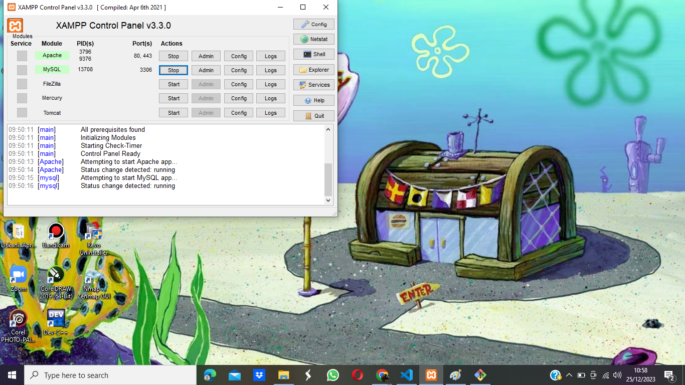
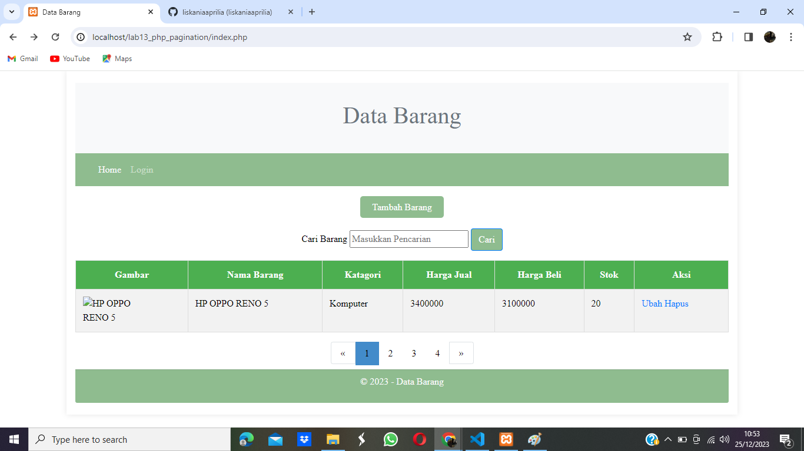

# PAGINATION

Pagination (pengindeksan halaman) adalah suatu teknik tata letak atau antarmuka pengguna yang digunakan untuk membagi suatu set data atau konten yang besar menjadi bagian-bagian yang lebih kecil yang disebut halaman. Tujuan dari pagination adalah untuk meningkatkan pengalaman pengguna dengan memudahkan navigasi dan mengurangi beban tampilan sekaligus meningkatkan kecepatan pemuatan halaman.

## 1. Tujuan
Pagination digunakan ketika terdapat kumpulan data atau konten yang besar yang sulit atau tidak efisien untuk ditampilkan dalam satu tampilan halaman. Dengan membagi konten menjadi halaman-halaman terpisah, pengguna dapat dengan mudah mengakses dan menavigasi melalui berbagai bagian data.

## 2. Struktur HTML
Pagination biasanya diimplementasikan sebagai daftar elemen-elemen HTML. Umumnya, struktur HTML-nya melibatkan elemen nav untuk menandakan navigasi dan elemen ul untuk daftar halaman.

## 3. Nomor Halaman
Setiap halaman direpresentasikan oleh elemen li dalam daftar, dan nomor halaman biasanya ditautkan menggunakan elemen a.

## 4. Halaman Aktif
Halaman yang sedang dilihat oleh pengguna sering ditonjol atau diberi gaya berbeda dengan memberikan kelas seperti active pada elemen tersebut.

## 5. Tombol Navigasi
Ada juga tombol navigasi "Sebelumnya" dan "Selanjutnya" untuk memudahkan perpindahan antar halaman.

## 6. Aksesibilitas (ARIA)
Menambahkan atribut ARIA, seperti aria-label, membantu meningkatkan aksesibilitas untuk pembaca layar.

# MEMBUAT PAGINATION

Pada prinsipnya untuk membatasi tampilan record data pada query mysql menggunakan LIMIT dan OFFSET

Query alwal:
```
$sql = “SELECT * FROM tabel_barang”;
```

Untuk menapilkan data dari record ke 1 sampai record ke 10:
```
$sql = “SELECT * FROM table_barang LIMIT 10”;
```

Untuk menampilkan data dari receord ke 11 sampai dengan record ke 20, disini digunakan OFFSET:
```
$sql = “SELECT * FROM table_barang LIMIT 10,20”;
```

Untuk membagi jumlah halaman, tentu kita harus ketahui dulu jumlam record secara keseluruhan, selanjutnya di bagi dengan jumlah record per halaman, maka akan diketahui jumlah halamannya.

# PRAKTIKUM - 13

## 1. MySQL Server

Untuk menjalankan MySQL Server dari menu XAMPP Contol.



## 2. Pagination

Untuk menjalankan Pagination, tambahkan source code berikut :

```PHP
<?php
include("koneksi.php");

// query untuk menampilkan data
$q = "";
if (isset($_GET['submit']) && !empty($_GET['q'])) {
    $q = $_GET['q'];
    $sql_where = "WHERE nama LIKE '{$q}%'"; 
}
$title = 'Data Barang';
$sql = 'SELECT * FROM data_barang ';
$sql_count = "SELECT COUNT(*) FROM data_barang";
if (isset($sql_where)) {
    $sql .= $sql_where;
    $sql_count .= $sql_where;
}
$result_count = mysqli_query($conn, $sql_count);
$count = 0;
if ($result_count) {
    $r_data = mysqli_fetch_row($result_count);
    $count = $r_data[0];
}
$per_page = 1;
$num_page = ceil ($count / $per_page);
$limit = $per_page;
if(isset($_GET['page'])) {
    $page = $_GET['page'];
    $offset = ($page - 1) * $per_page;
} else {
    $offset = 0;
    $page = 1;
}
$sql .= "LIMIT {$offset},{$limit}";
$result = mysqli_query($conn, $sql);

?>

<nav aria-label="Page navigation example" >
            <ul class = "pagination">
                <li class="page-item"><a class="page-link" href="#" aria-label="Previous"><span aria-hidden="true">&laquo;</span></a></li>
                <?php for ($i=1; $i <= $num_page; $i++) {
                    $link = "?page={$i}";
                    if (!empty($q)) $link .= "&q={$q}";
                    $class = ($page == $i ? 'active' : '');
                    echo "<li><a class=\"{$class}\" href=\"{$link}\">{$i}</a></li>";
                } ?>
                <li class="page-item"><a class="page-link" href="#" aria-label="Previous"><span aria-hidden="true">&raquo;</span></a></li>
            </ul>
            </nav>
```



# FINISH
